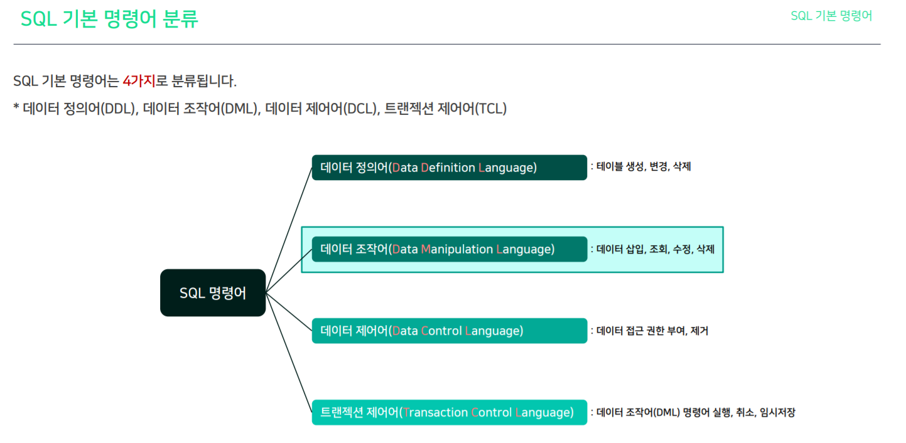

## SQL은 무엇인가?

- SQL은 Structured Query Language의 약자이며, 관계형 데이터베이스가 이해할 수 있는 구조화된 질의어다.
- 

## 관계형 데이터베이스(RDB)는 무엇인가?

- RDB는 Relational DataBase의 약자이며, 행과 열로 구성된 테이블이 다른 테이블과 관계를 맺고 모여있는 집합체를 의미합니다.
- 
- 위 질문에 답하기 위해서는 회원 테이블, 주문 테이블에서 데이터를 뽑아야 하는데 이러기 위해서는 테이블이 다른 테이블과 관계를 맺고 있어야 한다.

## 관계형 테이블은 무엇인가?

- 관계형 테이블은 관계형 데이터베이스에 저장되는 데이터의 집합이며, 행과 열로 구성되어있다.

---

### SQL 명령어 의  종류

SQL 기본 명령어는 4가지로 분류됩니다.

- 데이터 정의어(DDL), 데이터 조작어(DML), 데이터 제어어(DCL), 트랜젝션 제어어(TCL)

### DBA, Data Analyst 역할

