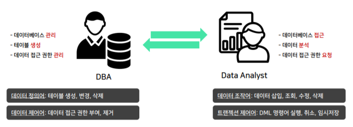
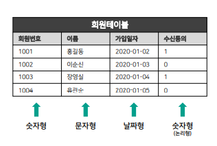
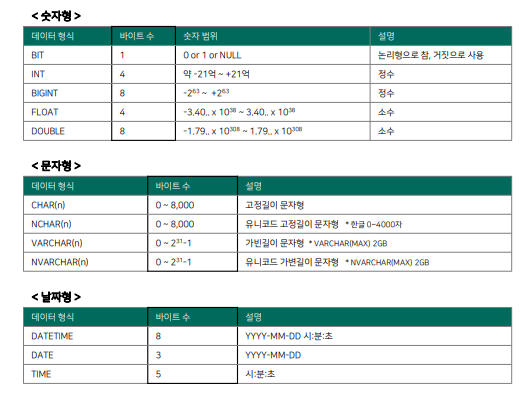
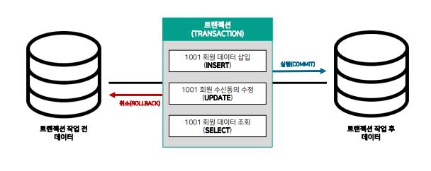

## SQL의 기본 구조  및 명령어  개념


### SQL은 무엇인가?

- SQL은 Structured Query Language의 약자이며, 관계형 데이터베이스가 이해할 수 있는 구조화된 질의어다.
- 


### 관계형 데이터베이스(RDB)는 무엇인가?

- RDB는 Relational DataBase의 약자이며, 행과 열로 구성된 테이블이 다른 테이블과 관계를 맺고 모여있는 집합체를 의미합니다.
- 
- 위 질문에 답하기 위해서는 회원 테이블, 주문 테이블에서 데이터를 뽑아야 하는데 이러기 위해서는 테이블이 다른 테이블과 관계를 맺고 있어야 한다.


### 관계형 테이블은 무엇인가?

- 관계형 테이블은 관계형 데이터베이스에 저장되는 데이터의 집합이며, 행과 열로 구성되어있다.


---


## SQL 명령어 의  종류


SQL 기본 명령어는 4가지로 분류됩니다.

- 데이터 정의어(DDL), 데이터 조작어(DML), 데이터 제어어(DCL), 트랜젝션 제어어(TCL)


### DBA, Data Analyst 역할

- DBA(DataBase Administrator) 역할 : 데이터베이스 관리자이며, 기업 내에서 데이터베이스를 관리합니다.
- Data Analyst 역할 : 데이터 분석을 통해, 새로운 인사이트를 도출합니다.

- 


### 데이터 정의어(DDL)

데이터 정의어는 테이블을 생성, 변경, 삭제할 때 사용하는 명령어입니다.

- 테이블은 각 열마다 반드시 1가지 데이터 타입으로 정의되어야 합니다.

  

  

- 데이터 타입

  


테이블은 각 열마다 **제약 조건**을 정의할 수 있습니다.

1. PK(Primary Key) : 중복되어 나타날 수 없는 단일 값
2. NOT NULL : NULL 값을 허용하지 않음(어떠한 값이 들어가야 함)


데이터 정의어는 테이블을 생성, 변경, 삭제할 때 사용하는 명령어입니다

- 테이블 생성

  ``` MYSQL
  CREATE TABLE 회원테이블(
  회원번호 INT PRIMARY KEY,
  이름 VARCHAR(2),
  가입일자 DATE NOT NULL,
  수신동의 BIT
  );
  ```

  

- 열 추가

  ``` SQL
  -- 성별 열 추가
  ALTER TABLE 회원테이블 ADD 성별 VARCHAR(2);
  ```

  

- 열 데이터 타입 변경

  ```sql
  -- 성별 열 타입 변경
  ALTER TABLE 회원테이블 MODIFY 성별 VARCHAR(20); # 데이터 타입 변경
  ```

  

- 테이블명 변경

  ``` MYSQL
  ALTER TABLE 회원테이블 RENAME 회원정보;
  ```

  

- 테이블 삭제

  ``` MYSQL
  DROP TABLE 회원테이블;
  ```


### 데이터 조작어(DML)

데이터 조작어는 데이터를 삽입, 조회, 수정, 삭제할 때 사용하는 명령어입니다

1.  삽입 : 제약조건 위반, 문자 및 날짜형(" "필요)

   ``` MYSQL
   -- INSERT INTO [테이블 명] VALUES [열별 데이터]
   INSERT INTO 회원테이블 VALUES (1001, "홍길동", "2021-01-01", 1);
   ```

   

2.  조회 : 모든 열(*), 특정 열 이름 변경(AS)

   ``` mysql
   -- 모든 열 조회
   SELECT * FROM 회원테이블;
   
   -- 특정 열 이름 변경하여 조회
   SELECT 회원번호,
   	이름 AS 성명
   	FROM 회원테이블; # 조회할 때만 이름이 변경되지 저장되지는 않는다
   ```

   

3.  수정 : 특정 조건(WHERE)

   ``` mysql
   -- 특정 조건 데이터 변경
   UPDATE 회원테이블
   	SET 수신동의 = "1"
   	WHERE 이름 = "홍길동";
   ```

   

4.  삭제 : 특정 조건(WHERE)

   ``` mysql
   -- 회원 테이블에서 이름이 "홍길동"인 데이터 삭제
   DELETE
   	FROM 회원테이블
   	WHERE 이름 = "홍길동";
   ```


### 데이터 제어어(DCL)

데이터 제어어는 DBA(데이터베이스 관리자)가 특정 사용자(USER)에게 데이터 접근, 권한을 부여(GRANT) 및 제거(REVOKE)할 때 사용하는 명령어입니다

1.  사용자 확인 

   ``` mysql
   -- 데이터베이스 사용
   USE MYSQL;
   
   -- MYSQL 사용자 확인
   SELECT *
   	FROM USER;
   ```


2.  사용자 추가 및 삭제

   ```mysql
   -- 사용자 아이디 및 비밀번호 생성
   CREATE USER "TEST"@LOCALHOST IDENTIFIED BY "TEST"; # ID, PW : "TEST"
   
   -- 비밀번호 변경
   SET PASSWORD FOR "TEST"@LOCALHOST = "1234"; # PW : "TEST" => "1234"
   
   -- 사용자 삭제
   DROP USER "TEST"@LOCALHOST;
   ```


3.  권한 부여 및 삭제

   ``` mysql
   -- 특정 권한 부여
   GRANT SELECT, DELETE ON PRACTICE.회원테이블 TO "TEST"@LOCALHOST;
   
   -- 특정 권한 제거
   REVOKE DELETE ON PRACTICE.회원테이블 FROM "TEST"@LOCALHOST;
   
   -- 모든 권한 부여
   GRANT ALL ON PRACTICE.회원테이블 TO "TEST"@LOCALHOST;
   
   -- 모든 권한 회수
   REVOKE ALL ON PRACTICE.회원테이블 FROM "TEST"@LOCALHOST;
   ```


### 트랜젝션 제어어(TCL)

트랜젝션 제어어는 **데이터 조작어(DML) 명령어** 를 실행, 취소, 임시저장할 때 사용하는 명령어입니다.

> cf. 트랜젝션은 **분할할 수 없는 최소 단위**이며 논리적인 작업 단위입니다.
>
> 


- 실행(COMMIT) : 모든 작업을 최종 실행

  ``` mysql
  /* BEGIN + COMMIT */
  
  -- 트랜젝션 시작
  BEGIN;
  
  -- 데이터 삽입
  INSERT INTO 회원테이블 VALUES (1001, "홍길동", "2021-01-01", 1);
  ```

  

  

- 취소(ROLLBACK) : 모든 작업을 되돌림

  ``` mysql
  /* BEGIN + ROLLBACK */
  
  -- 트랜젝션 시작
  BEGIN;
  
  -- 데이터 삽입
  INSERT INTO 회원테이블 VALUES (1001, "홍길동", "2021-01-01", 1);
  
  -- 테이블 조회
  SELECT *
  	FROM 회원테이블;
  
  -- 취소
  ROLLBACK;
  
  -- 테이블 조회
  SELECT * FROM 회원테이블;
  ```

  

-  임시 저장(SAVEPOINT) : ROLLBACK 저장점을 지정하는 명령어

  ```mysql
  -- 트랜젝션 시작
  BEGIN;
  
  -- 데이터 삽입
  INSERT INTO 회원테이블 VALUES (1001, "홍길동", "2021-01-01", 1);
  
  -- 임시 저장 1
  SAVEPOINT S1;
  
  -- 데이터 변경
  UPDATE 회원테이블
  	SET 이름 = "이순신";
  
  -- 임시 저장 2
  SAVEPOINT S2;
  
  -- 1001 데이터 삭제
  DELETE
  	FROM 회원테이블;
  
  -- 임시 저장 3
  SAVEPOINT S3;
  
  -- 회원테이블 조회
  SELECT * FROM 회원테이블;
  
  -- SAVEPOINT S2로 ROLLBACK
  ROLLBACK TO S2;
  
  -- 회원테이블 조회(S2로 ROLLBACK 됐는지 확인)
  SELECT * FROM 회원테이블;
  
  -- 실행
  COMMIT;
  
  /* COMMIT을 하면 임시저장된 SAVEPOINT 들은 없어지게 된다. */
  -- ERROR 확인
  ROLLBACK TO S2; # => SAVEPOINT DOES NOT EXIST 에러 발생
  ```

  
